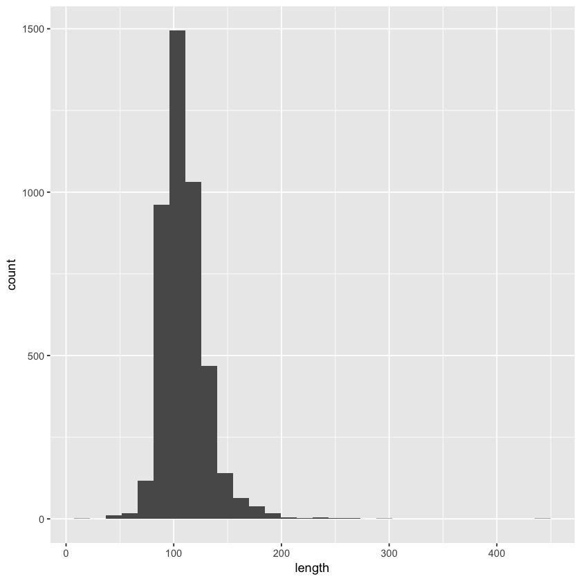
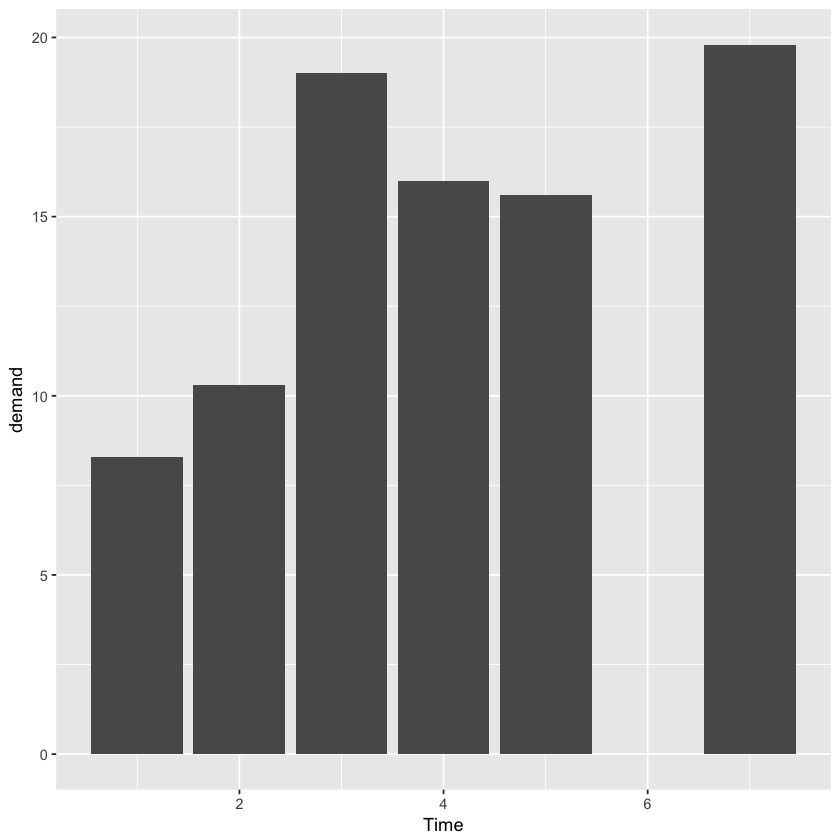

## 导入 ggplot2 包


```R
library(ggplot2)
```

## 读取数据


```R
movies <- read.csv("douban_movie_clean.txt", sep="^", header=TRUE)
```

## 用 ggplot2 画出电影时间长度的分布


```R
ggplot(movies) + geom_histogram(aes(x=length))
```

    `stat_bin()` using `bins = 30`. Pick better value with `binwidth`.
    Warning message:
    “Removed 81 rows containing non-finite values (stat_bin).”





## 条形图 Bar


```R
BOD
```


<table>
<thead><tr><th scope=col>Time</th><th scope=col>demand</th></tr></thead>
<tbody>
	<tr><td>1   </td><td> 8.3</td></tr>
	<tr><td>2   </td><td>10.3</td></tr>
	<tr><td>3   </td><td>19.0</td></tr>
	<tr><td>4   </td><td>16.0</td></tr>
	<tr><td>5   </td><td>15.6</td></tr>
	<tr><td>7   </td><td>19.8</td></tr>
</tbody>
</table>


```R
ggplot(BOD) + geom_bar(aes(x=Time, y=demand), stat="identity")
```





```R

```


```R

```
